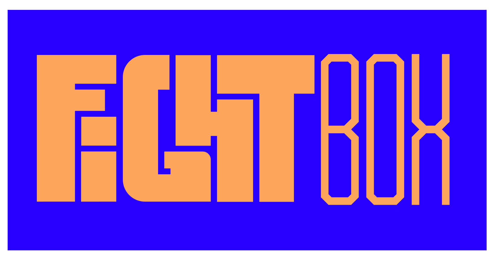

# Fightbox

Fightbox.fr is a E-market website to receive mounthly a secret box which contains products about sport combat.

## History

The project was created by [Sarah Soumahoro](soumahoro@fightbox.fr) who is a practicer of the Jujitsu sport combat. She was alone on the beginning of the project so she started her website by using [Ciklik CMS](https://www.ciklik.co/en/)/. This CMS was in the perfect scope of the requirements of Sarah : A non-developer platform to manage an e-market website which is made to sell products on mounthly subscription payment method.

But customization limitations of the website design told this CMS was not a good long term solution morother Sarah have now a team for the design/UI/UX part.

So the developer has chosen to migrate on other technologies. Firstly for the frontend part of the website application VueJs was chosen cause it's a lightweight frontend framework.

The backend part is not really a final choice yet but it can be the Prestashop CMS which include the possibilty to integrate a VueJs app.

## Specifications

- E-market website
- Subscription mounthly payment
- Selling boxes in the combat sport
- Newsletter feature
- Contact form feature
- User account (Login/Signup)

For each technical specification details you can check out the **[issue section](https://github.com/TavaresDylan/Fightbox_Landing_Page/issues)** of this repository on Github.

# Get started

⚠️ You need an access on the repository please contact [Dylan Tavares](tavares.dylan@gmail.com) to be added on the project as contributor.

(In the near future the repository should be moved to an organization account)

## Requirements

Node.js >= 16.0
Yarn package manager
Git

## Start-up development

Firstly **clone** the project into your local files

`git clone https://github.com/TavaresDylan/Fightbox_Landing_Page.git`

When the project is cloned you must start the project from the develop branch

`git checkout develop`

**Download required dependencies :**
(into the app folder which is the frontend of the application)

`yarn install`

Finnaly run the application

`yarn run dev`

## Hosting

Currently the first draft is hosted on through Github pages.
The domain name is *fighbox.fr* the DNS provider is [Google](https://domains.google/). If you need to manage the DNS please contact [Dylan Tavares](tavares.dylan@gmail.com) to get access crendentials.
In the near future the website (Static V2.0) will be hosted on a Cloud Provider that will be better to handle the pricing of the hosting.
